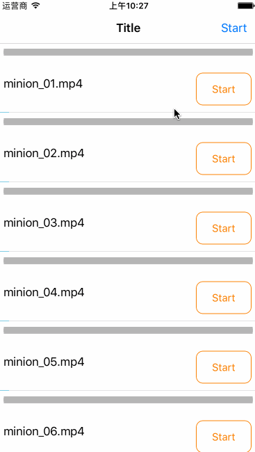

# MCDownloader
A simple and powerful iOS downloader.  [中文简介](http://www.jianshu.com/p/062327c5846a)




## Installation
### Cocoapods
[CocoaPods](http://cocoapods.org) is a dependency manager for Cocoa projects. You can install it with the following command:

```bash
$ gem install cocoapods
```

> CocoaPods 1.1.0+ is required to build MCDownloadManager 1.0.0+.

To integrate MCDownloadManager into your Xcode project using CocoaPods, specify it in your `Podfile`:

```ruby
pod 'MCDownloader', '~> 1.0.0'
```

Then, run the following command:

```bash
$ pod install
```


## Usage
### Start the download

	[[MCDownloader sharedDownloader] downloadDataWithURL:[NSURL URLWithString:url] progress:^(NSInteger receivedSize, NSInteger expectedSize, NSInteger speed, NSURL * _Nullable targetURL) {
	                
	            } completed:^(MCDownloadReceipt * _Nullable receipt, NSError * _Nullable error, BOOL finished) {
	                NSLog(@"==%@", error.description);
	            }];
	            
### Stop the download

	[[MCDownloader sharedDownloader] cancel:receipt completed:^{
	            [self.button setTitle:@"Start" forState:UIControlStateNormal];
	        }];

### Remove the download

	[[MCDownloader sharedDownloader] remove:receipt completed:^{
	            [self.tableView reloadData];
	        }];
	      
### Get the download information

	MCDownloadReceipt *receipt = [[MCDownloader sharedDownloader] downloadReceiptForURLString:url];
	
### Cancel and remove all downloads

	[[MCDownloader sharedDownloader] cancelAllDownloads];
	
	[[MCDownloader sharedDownloader] removeAndClearAll];
	
## License
MCDownloader is released under an MIT license. See License.md for more information.